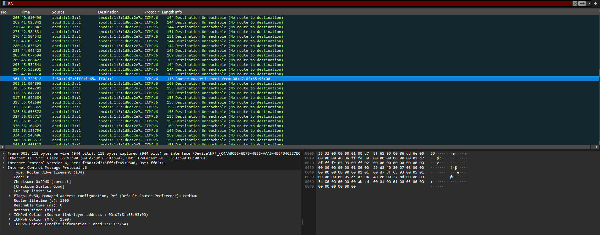
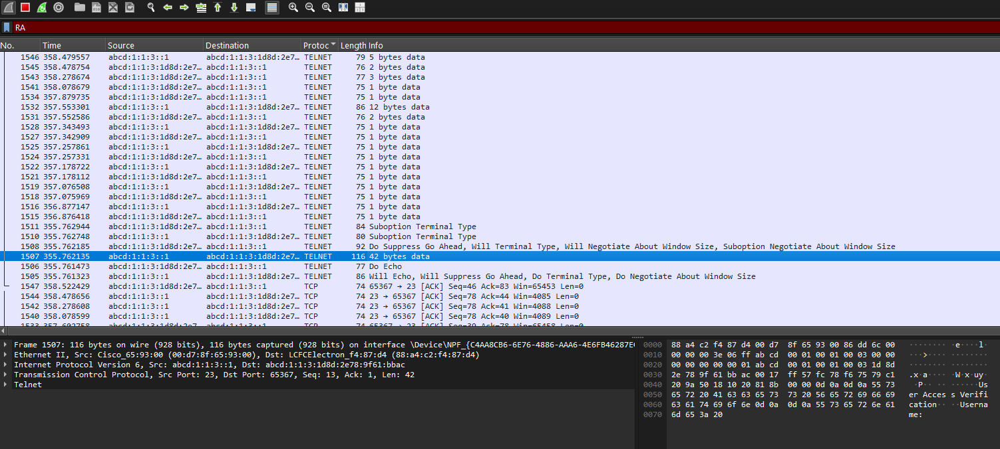

# Informe de acciones en el laboratorio dos

## Router Dos:

### 1. **Reinicio y borrado de configuraciones previas**

* Se ejecutaron múltiples veces `erase startup-config` para limpiar la NVRAM.
* Se realizaron varios **reloads** para reiniciar el equipo.
* Al inicio se veía como `R3`, pero luego se configuró correctamente como **R2**.

---

### 2. **Configuración básica**

* **Hostname:** `R2`.
* **Usuario local:** `cisco` con privilegio 15 y contraseña `cisco`.
* **VTY:** habilitado con `login local` y más adelante `transport input telnet`.
* **Se deshabilitó** `ip domain-lookup` y la encriptación de contraseñas.

---

### 3. **Interfaces configuradas**

* **GigabitEthernet0/0**

    * IPv6: `ABCD:1:1:3::1/64`.
    * Habilitado con `ipv6 enable`, DHCPv6 y `ipv6 eigrp 32000`.
* **GigabitEthernet0/1**

    * Apagada (`shutdown`).
* **Serial0/0/0**

    * Encapsulación PPP.
    * IPv6: `ABCD:1:1:2::2/64`.
    * Asociada a EIGRP IPv6.
* **Serial0/0/1**

    * Apagada (`shutdown`).
    * Clock rate configurado en `2000000`.
* **Loopback0** no se configuró.

---

### 4. **Protocolos y servicios**

* **IPv6 habilitado** (`ipv6 unicast-routing`).
* **DHCPv6** configurado:

    * Pool `LAN2` con prefijo `ABCD:1:1:3::/64`.
    * DNS: `ABCD:3::F0`.
    * Dominio: `redes2.elpoli.edu.co`.
* **EIGRP para IPv6 (AS 32000)**

    * Router-ID: `2.2.2.2`.
    * Se estableció vecindad con un router en **Serial0/0/0** (`FE80::2A2:EEFF:FE2B:D6C0`).

---

### 5. **Resultados de enrutamiento**

* Tabla de rutas IPv6 mostró conectividad:

    * Conexiones locales (`ABCD:1:1:2::/64`, `ABCD:1:1:3::/64`).
    * Vecinos vía EIGRP aportaron rutas a redes como `ABCD:1:1:1::/64`, `ABCD:1:1:4::/64`, `ABCD:1:1:5::/64`, `ABCD:1:1:6::/64` y `2001:DB8:13::/64`.
* El DHCPv6 reportó clientes activos (1 al inicio, luego 2).

---

### 6. **Observaciones finales**

* Hubo varios intentos fallidos al escribir comandos (`reaload`, `inteface`, `banwith`, etc.), pero se corrigieron.
* El router terminó con:

    * **IPv6 funcionando**,
    * **EIGRP estableciendo vecindades**,
    * **DHCPv6 entregando direcciones**,
    * **Acceso remoto por Telnet**.

## PC1:

### 1. **Información general del equipo**

* **Sistema:** Windows 10
* **Hostname:** `LAPTOP-SLO2005`
* **Dominio DNS principal:** vacío
* **Lista de búsqueda DNS:** `redes2.elpoli.edu.co`

---

### 2. **Adaptadores de red detectados**

El PC tiene varios adaptadores (físicos y virtuales):

* **vEthernet (Default Switch – Hyper-V):**

    * IPv4: `172.22.112.1/20`
    * Sin gateway

* **vEthernet (WSL – Hyper-V):**

    * IPv4: `172.25.64.1/20`
    * Sin gateway

* **Ethernet 2 (VirtualBox Host-Only):**

    * IPv4: `192.168.56.1/24`
    * Sin gateway

* **Ethernet (físico – Intel I219-LM):**

    * DNS: `redes2.elpoli.edu.co`
    * IPv6 local: `fe80::2f44:e9d3:8944:5c63%17`
    * IPv4: `169.254.16.197/16` → dirección **APIPA** (no recibió DHCP).
    * Gateway: vacío
    * Servidor DNS IPv6: `abcd:3::f0`

* **VMware VMnet1:**

    * IPv4: `192.168.168.1/24`
    * DHCP activado (servidor `192.168.168.254`)

* **VMware VMnet8:**

    * IPv4: `192.168.5.1/24`
    * DHCP activado

* **Wi-Fi (Intel AX201):**

    * Estado: desconectado
    * Dominio: `inalambricapjic.edu.loc`

* **Adaptadores Wi-Fi Direct Virtual (Microsoft):**

    * Están presentes pero sin conexión.

---

### 3. **Observaciones**

* El adaptador **Ethernet físico** no logró obtener una IP válida de DHCP y quedó con una dirección APIPA (`169.254.x.x`). Esto indica un posible problema de conexión hacia el router o servidor DHCP.
* El DNS IPv6 configurado (`abcd:3::f0`) coincide con el servidor que se configuró en el **Router2**, lo que indica que el PC debería estar conectado a esa red IPv6.
* Las interfaces de VMware y VirtualBox aparecen activas, lo cual puede interferir con la conectividad real si no se priorizan correctamente.

## Evidencias gráficas

### Paquete RA

### Paquete Telnet

## Logs del sniffer

👉 [Descargar captura de red (Sniffer-logs.pcapng)](./logs/sniffer/Sniffer-logs.pcapng)